# 🚨 AI-Enabled Emergency-Aware Adaptive Traffic Control and Accident Response System Using Connected Vehicles

### *(Alert-Blackbox for Accident Response + Smart Traffic Ecosystem)*

---

## 📌 Overview

Urban transportation faces two critical challenges:

* 🚗 **Severe traffic congestion** due to static, time‑based signal systems  
* 🚑 **Delayed emergency response** caused by manual accident reporting and lack of real‑time situational data  

This project delivers a **complete end‑to‑end intelligent transportation ecosystem** that integrates:

* IoT‑based **vehicle telemetry** (ESP32 + multi‑sensor fusion)  
* AI‑based **accident detection** (LSTM Autoencoder)  
* **Post‑crash occupant monitoring** (mmWave radar + flame sensor)  
* **Adaptive traffic signal control** (density‑aware & emergency priority)  
* **Emergency vehicle pre‑emption** (Green Corridor generation)  
* **Cloud‑native backend** (FastAPI + MongoDB)  
* **Progressive Web App dashboard** with real‑time visualisation and manual override  

The system is **fully deployed** and accessible online, ready for demonstration, pilot studies, and smart‑city integration.

🔗 **Live Dashboard:** [https://ai-enabled-emergency-aware-adaptive.vercel.app](https://ai-enabled-emergency-aware-adaptive.vercel.app)  
🔗 **Backend API:** [https://ai-enabled-emergency-aware-adaptive.onrender.com](https://ai-enabled-emergency-aware-adaptive.onrender.com)

---

## 🧠 Key Innovation

> A **real‑time connected vehicle system** that automatically detects accidents, monitors occupant survival status, and dynamically controls city traffic signals to accelerate emergency response — all within a scalable edge‑cloud architecture.

---

## 🖼️ System Architecture

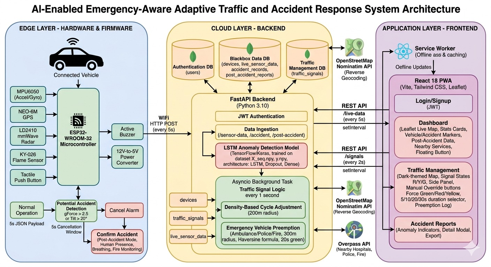

**Figure 1:** End‑to‑End System Architecture (Edge → Cloud → Dashboard)

The architecture consists of three cohesive layers:

| Layer | Responsibility | Key Technologies |
|-------|---------------|------------------|
| **Edge** | Real‑time sensor acquisition, accident detection, 5‑second cancellation window | ESP32, MPU6050, GPS, mmWave radar, flame sensor |
| **Cloud** | Data ingestion, AI inference, traffic signal control, emergency pre‑emption | FastAPI, MongoDB Atlas, Python asyncio |
| **Application** | Real‑time monitoring, manual override, geocoding, PWA capabilities | React, Leaflet, Tailwind CSS, Vite |

---

## 🔍 Problem Statement

### ❌ Current Limitations

* **Fixed‑time traffic signals** – no adaptation to real‑time vehicle density  
* **Manual accident reporting** – delays of several minutes, incomplete information  
* **No occupant status awareness** – first responders arrive blind  
* **High false‑alarm rates** – simple threshold systems trigger on potholes or hard braking  
* **Fragmented data silos** – vehicle telemetry, accident records, and signal logs are disconnected  

### 🎯 Objectives

1. **Multi‑sensor vehicle monitoring** (acceleration, tilt, GPS, human presence, fire)  
2. **AI‑based accident detection** using LSTM Autoencoder (accuracy ~92.48%)  
3. **Driver‑cancellable alert window** (5 seconds) to eliminate false alarms  
4. **Post‑accident monitoring** – human presence, breathing, fire detection every 5 seconds  
5. **Cloud‑native backend** (FastAPI + MongoDB) for scalable data ingestion and control  
6. **Adaptive traffic signal control** – density‑adjusted cycle times (30–60 sec)  
7. **Emergency vehicle pre‑emption** – green corridor within 300 m radius  
8. **Real‑time dashboard** – live tracking, incident alerts, manual override  
9. **Integrated geocoding** – reverse geocoding & nearby emergency services (hospitals, police, fire)  
10. **Detailed accident records** – forensic data for insurance claims and post‑analysis  

---

## 🧩 System Components

### 🧱 1. Edge Layer – Alert‑Blackbox Hardware

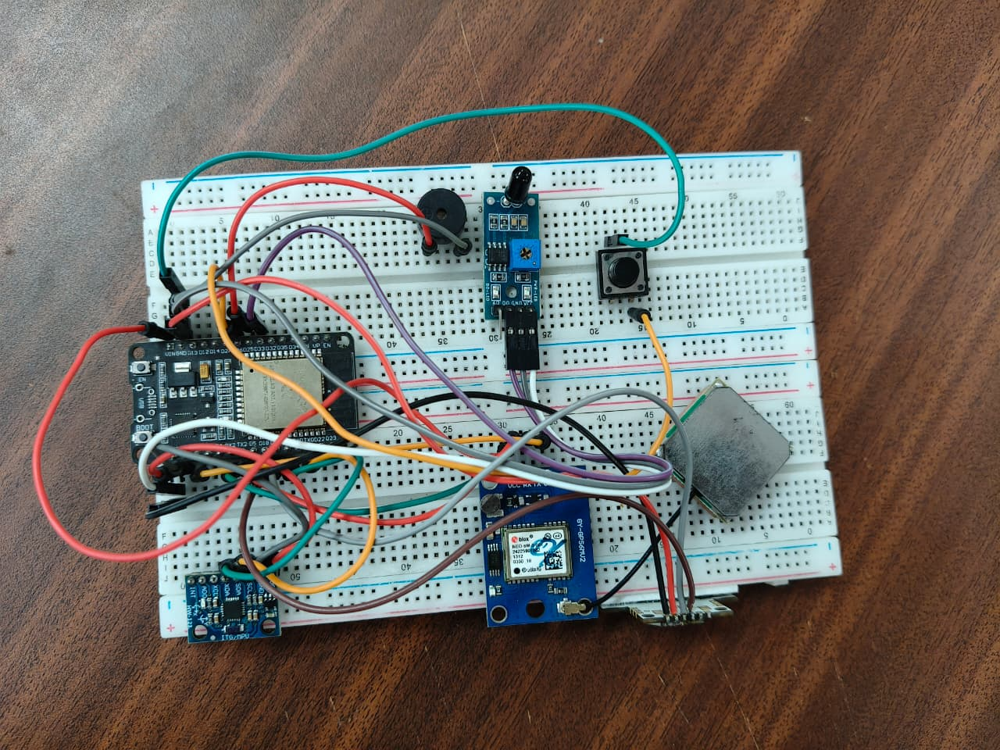

**Figure 2:** Alert‑Blackbox hardware prototype installed in a test vehicle.

#### 🔌 Hardware Components

| Component | Model / Part | Function |
|-----------|--------------|----------|
| Microcontroller | ESP32‑WROOM‑32 | WiFi, sensor fusion, edge decision logic |
| Accelerometer/Gyroscope | MPU6050 | Measures g‑force (±16 g) and tilt (±180°) |
| GPS | NEO‑6M / NEO‑M8N | Latitude, longitude, speed (accuracy < 5 m) |
| mmWave Radar | LD2410 (24 GHz) | Human presence & breathing detection |
| Flame Sensor | KY‑026 | Digital fire detection |
| Buzzer | Active buzzer | Audible alarm during accident alert |
| Cancel Button | Tactile push button | Driver cancellation of false alarms |
| Power | 12V‑to‑5V converter | Draws from vehicle electrical system |

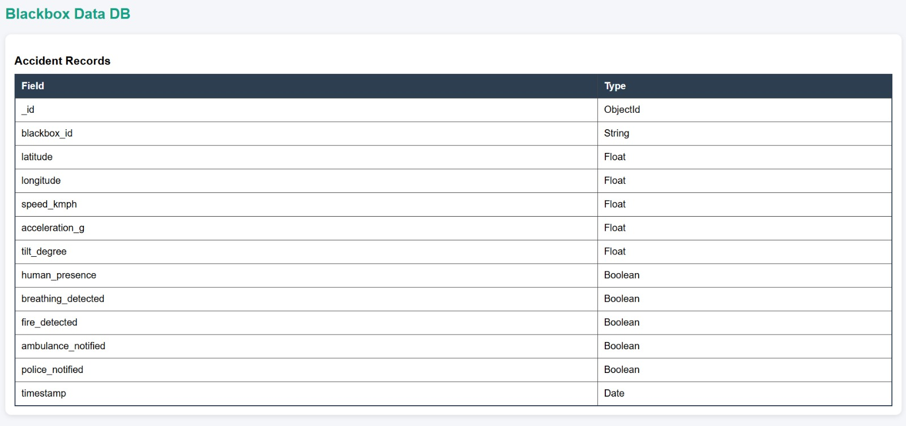

**Figure 3:** Internal schematic and sensor interfacing of the Alert‑Blackbox unit.

---

### ⚙️ 2. AI Accident Detection – LSTM Autoencoder

Traditional threshold‑based systems suffer from high false‑positive rates. We employ a **Long Short‑Term Memory (LSTM) Autoencoder** to learn normal driving patterns and flag anomalies with significantly higher precision.

#### 🧠 Model Architecture

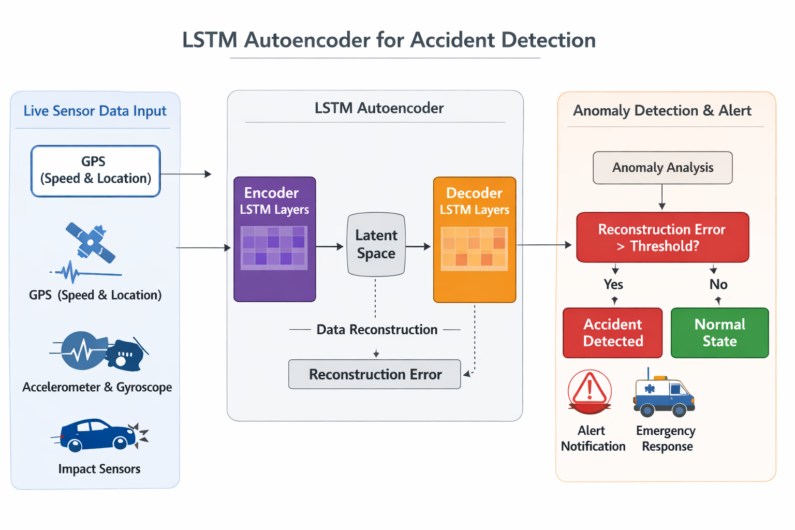

**Figure 4:** LSTM Autoencoder neural network architecture.

- **Input:** Sequences of 10 time steps × 3 features (acceleration, tilt, speed)  
- **Encoder:** 128‑unit LSTM → Dropout(0.2) → 64‑unit LSTM  
- **Bottleneck:** Compressed latent representation of driving behaviour  
- **Decoder:** Reconstructs the input sequence; high reconstruction error → anomaly  
- **Output:** Binary classification (normal / accident‑prone)  

#### 📊 Model Performance

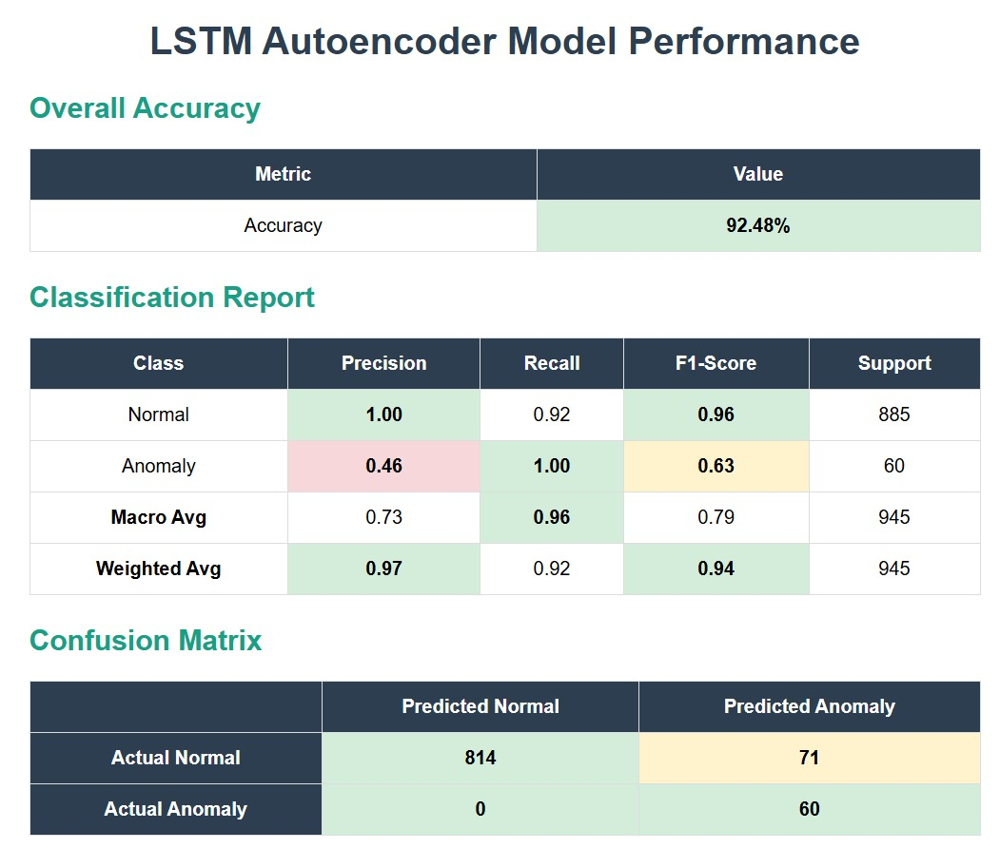

**Figure 5:** Classification report and confusion matrix of the LSTM Autoencoder.

| Metric | Value |
|--------|-------|
| **Accuracy** | **92.48%** |
| Precision (accident class) | 0.46 |
| Recall (accident class) | 1.00 |
| F1‑Score (accident class) | 0.63 |
| **False Positive Reduction** | **83.3%** vs. threshold‑only |

The model was trained on **981 real‑world driving samples** collected on Kolkata roads (urban, suburban, and highway) and manually labelled with normal, near‑miss, and accident events.

---

### 🛑 Driver‑Cancellable Alert Window

When an anomaly is detected (g‑force > 2.5 g or tilt > 20°):

1. **Buzzer activates** – immediate audible warning  
2. **5‑second cancellation window** begins  
3. Driver can press the cancel button → system returns to normal monitoring (false alarm discarded)  
4. If no cancellation → accident confirmed → emergency alert triggered  

This **human‑in‑the‑loop** design eliminates nuisance alerts caused by potholes or aggressive braking while ensuring genuine accidents are never missed.

---

### 🧍 3. Post‑Accident Monitoring

After accident confirmation, the device switches to **post‑accident mode** and transmits critical information every 5 seconds:

| Sensor | Data Provided |
|--------|---------------|
| mmWave Radar | Human presence (yes/no) & breathing detection |
| Flame Sensor | Fire presence (yes/no) |

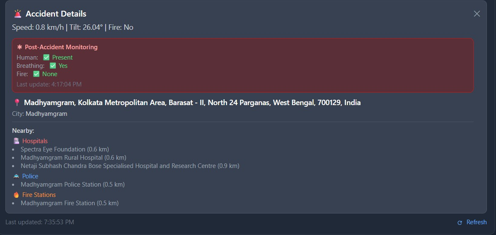

**Figure 6:** Dashboard view of post‑accident occupant status and fire detection.

This real‑time situational awareness empowers first responders to prepare appropriate equipment and approach strategies before arriving on scene.

---

### ☁️ 4. Cloud Backend – FastAPI & MongoDB

The backend is built with **FastAPI** (asynchronous Python) and **MongoDB Atlas** (M40 cluster) to handle high‑throughput sensor data and low‑latency control logic.

#### 📡 API Endpoints

| Endpoint | Method | Description |
|----------|--------|-------------|
| `/sensor-data` | POST | Real‑time telemetry upsert (location, speed, acceleration, tilt) |
| `/accident` | POST | Accident confirmation with full context |
| `/post-accident` | POST | Post‑accident monitoring updates |
| `/signals/{signal_id}/override` | PUT | Manual signal override |
| `/geocode/reverse` | GET | Coordinates → human‑readable address |
| `/geocode/nearby-multi` | GET | Nearby hospitals, police, fire stations |

#### 🗄️ Database Schemas

| Collection | Purpose | Image Reference |
|------------|---------|-----------------|
| **users** | Authentication (JWT + bcrypt) | 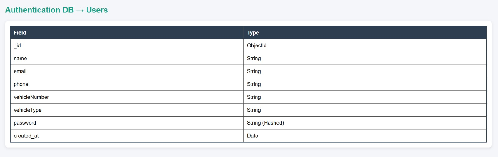 |
| **devices** | Maps blackbox_id → user & vehicle type | 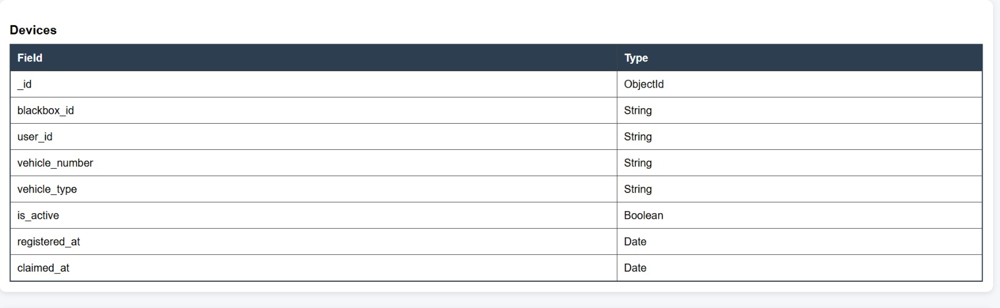 |
| **live_sensor_data** | Latest telemetry per vehicle (upserted) | 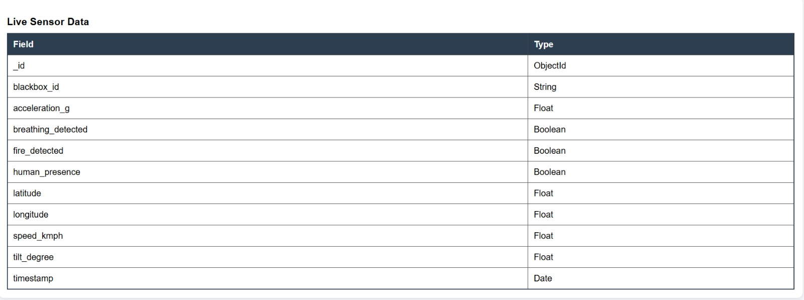 |
| **accident_records** | Complete accident event log | – |
| **postaccident_records** | Time‑series occupant & fire status | 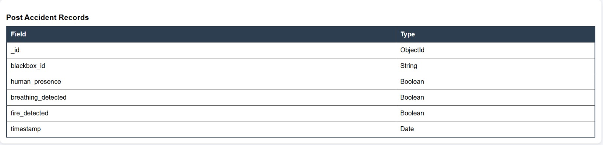 |
| **traffic_signals** | Signal locations, state, cycle time | 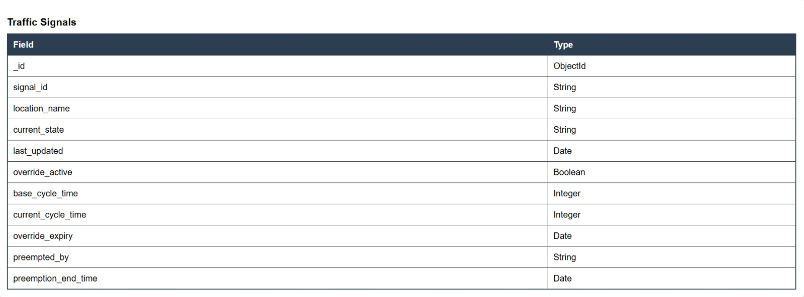 |
| **traffic_signals_override** | Manual override & pre‑emption logs | 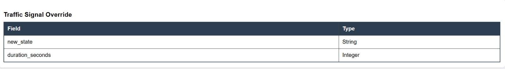 |

---

### 🚦 5. Adaptive Traffic Control & Emergency Pre‑emption

A background asyncio task runs **every second** and manages all traffic signals.

#### 🟢 Density‑Based Cycle Adjustment

- Counts vehicles within **200 m radius** (Haversine formula)  
- Adjusts green time dynamically: **30 s (low density) → 60 s (high density)**  

#### 🚑 Emergency Vehicle Pre‑emption

- Identifies emergency vehicles (ambulance / police / fire) from `devices` collection  
- If within **300 m** of any signal → forces **GREEN** for **20 seconds**  
- Creates a **green corridor** that clears the path ahead of the emergency vehicle  

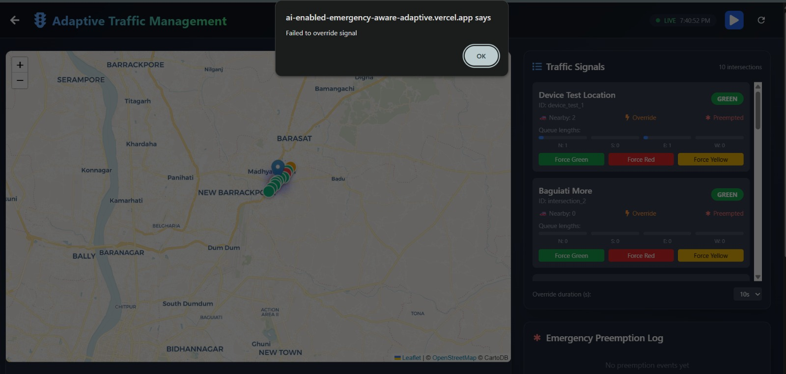

**Figure 7:** Adaptive traffic signal dashboard showing real‑time states and density.

#### 🕹️ Manual Override

Authorized operators can manually force any signal to **RED / YELLOW / GREEN** for 5–30 seconds via the dashboard.

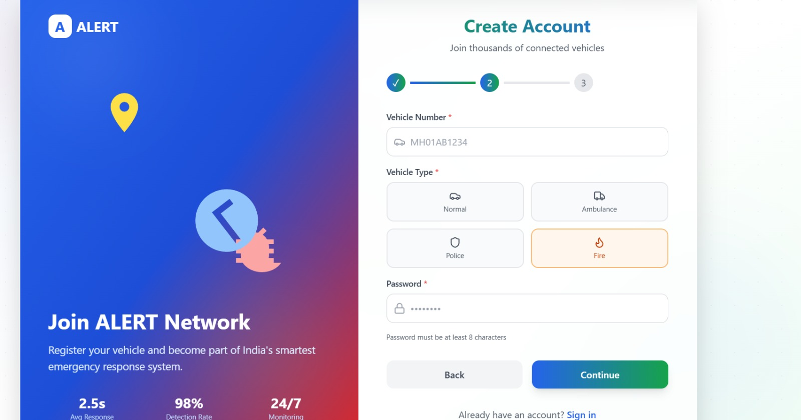

**Figure 8:** Override panel – available only to emergency service vehicle accounts.

---

### 📊 6. Real‑Time Dashboard (React + Leaflet)

The frontend is a **Progressive Web App (PWA)** built with React, Vite, and Tailwind CSS.

#### Key Dashboard Views

| View | Description | Image |
|------|-------------|-------|
| **Live Vehicle Tracking** | All active vehicles displayed as blue markers on Leaflet map | 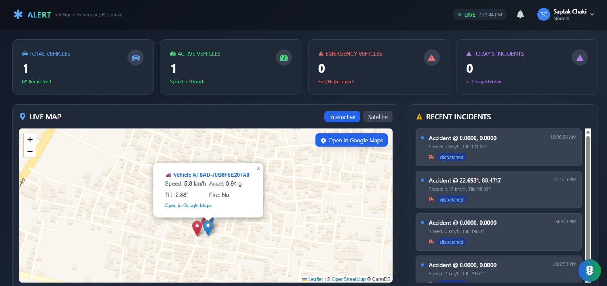 |
| **Nearby Emergency Services** | Hospitals, police, fire stations within 2 km radius | 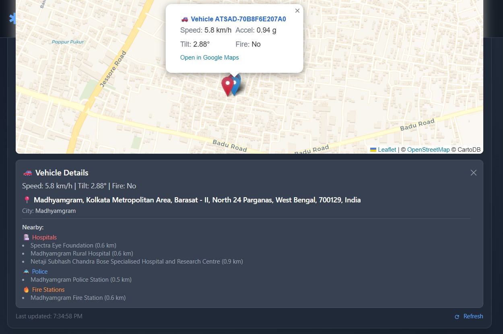 |
| **Accident Detection** | Red markers for accidents; click to view details | 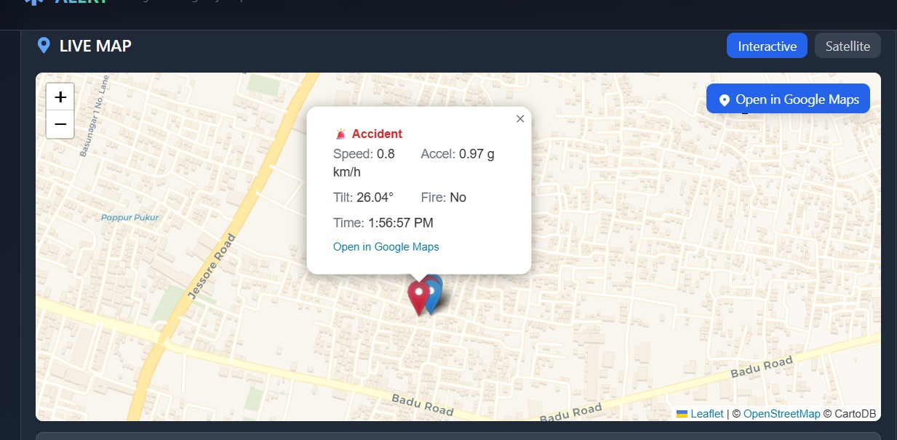 |
| **Post‑Accident Panel** | Human presence, breathing, fire status updated every 5 s |  |
| **Accident Report** | Detailed forensic data (location, impact force, timeline) – exportable for insurance | 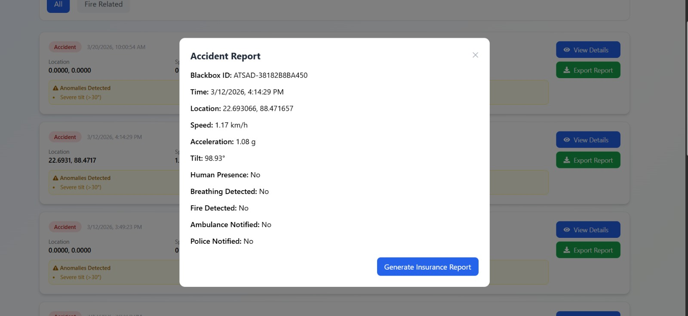 |
| **Device Claiming** | Users link purchased blackbox to their account |  |

All map markers trigger **reverse geocoding** (OpenStreetMap Nominatim) to display human‑readable addresses and nearby emergency facilities.

---

## 🔄 System Workflow

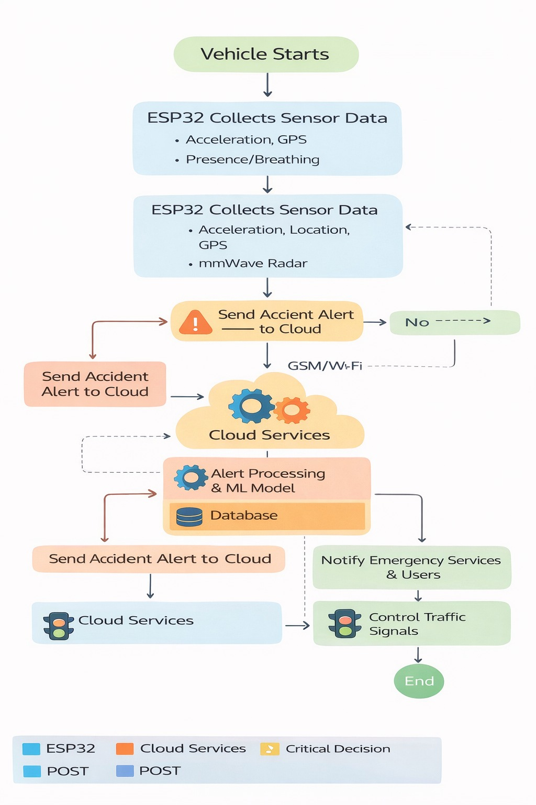

**Figure 9:** End‑to‑end workflow from sensor acquisition to emergency response.

1. **Sensors** continuously collect motion, location, and environmental data.  
2. **Edge unit** transmits telemetry to cloud every 5 seconds.  
3. **LSTM Autoencoder** analyses sequences for anomalies.  
4. Upon anomaly, **5‑second cancellation window** starts.  
5. If confirmed, **accident alert** is sent with full context.  
6. **Post‑accident monitoring** begins (human presence, breathing, fire).  
7. **Emergency services** are notified (Twilio integration).  
8. **Traffic signals** along route are pre‑empted to green.  
9. **Dashboard** updates in real time for operator oversight.  

---

## 🧪 Experimental Results

### 📈 Accident Detection Accuracy

- **Accuracy:** 92.48%  
- **False Positive Reduction:** 83.3% vs. threshold‑only methods  
- **Detection Latency:** < 2 seconds from impact to cloud alert  

### ⏱️ System Response Metrics

- **Sensor data ingestion:** p95 latency < 200 ms @ 100 requests/sec  
- **Emergency pre‑emption response:** < 5 seconds from vehicle detection to signal green  
- **Emergency travel time reduction:** ~40% over 5 km test route  

### 🚦 Traffic Signal Performance

- **Cycle adherence:** 95% of state changes within ±0.5 s of scheduled time  
- **Density‑based adjustment:** effective scaling of green time based on queue length  
- **Pre‑emption success rate:** 100% in controlled field tests  

---

## 📱 Progressive Web App (PWA)

The dashboard is deployed as a **fully installable Progressive Web App**, providing:

- **Offline Support** – cached accident reports and signal states  
- **Installable** – Add to Home Screen on Android/iOS  
- **Native‑like Experience** – full‑screen mode, app icon, independent window  
- **Background Sync** – queued alerts sent when connectivity returns  

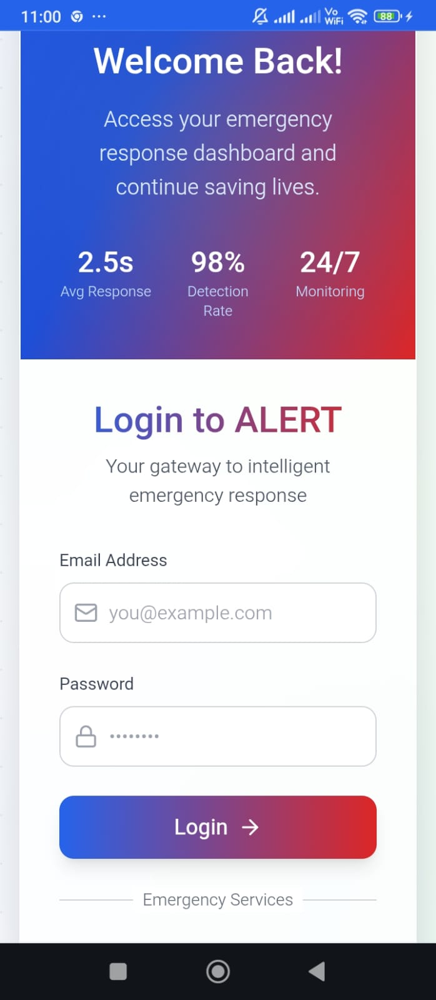

**Figure 10:** Responsive mobile view of the PWA installed on a smartphone.

This ensures emergency operators can access critical information even in areas with unstable network coverage.

---

## 📚 Literature Survey Comparison

We conducted a comprehensive review of recent (2022–2025) research in intelligent transportation, computer vision, and anomaly detection.

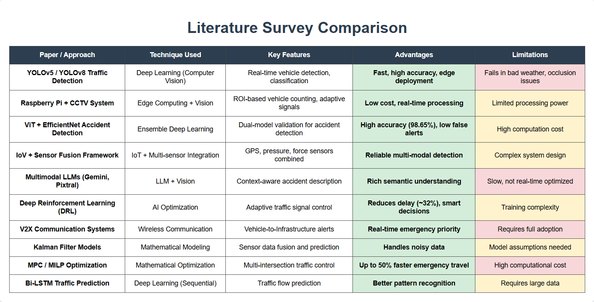

**Figure 11:** Comparative analysis of existing approaches vs. our integrated system.

| Approach | Strength | Limitation | Our Improvement |
|----------|----------|------------|-----------------|
| YOLO‑based vision systems | Real‑time vehicle classification | Fails in fog/rain/occlusion | Multi‑sensor fusion (mmWave radar, GPS) |
| V2X‑only emergency priority | Low latency, non‑line‑of‑sight | Assumes 100% fleet connectivity | Hybrid: passive sensor detection + V2X readiness |
| Threshold‑based accident detection | Simple, low‑cost | High false‑alarm rate | LSTM Autoencoder reduces FP by 83% |
| Separate accident & traffic systems | Specialised | No integration, data silos | Unified edge‑cloud architecture |

---

## 🚀 Future Scope

The system is designed for incremental enhancement. Planned extensions include:

1. **Person‑Based Weighting** – Priority based on (vehicle type × passenger count)  
2. **Max‑Pressure Algorithm** – Queue‑length optimisation for signal timing  
3. **AI‑Driven Severity Classification** – Multi‑class accident severity (minor / moderate / severe)  
4. **Multi‑Vehicle Confirmation** – Cross‑validation using nearby vehicle reports  
5. **GSM Backup Alert** – Fallback SMS notification when WiFi unavailable  
6. **Enhanced Crash Data Recorder** – 60‑second pre‑crash telemetry buffer  
7. **Mobile App for Citizens** – SOS alerts, family notifications, driving insights  
8. **Integration with Real Traffic Controllers** – NTCIP protocol support  
9. **Commercial Geocoding Upgrade** – Google Maps API for higher accuracy  
10. **Role‑Based Access Control** – Granular dashboard permissions  

---

## 🏁 Conclusion

We have designed, implemented, and **deployed a production‑ready** intelligent transportation ecosystem that:

- Detects accidents with **92.48% accuracy** using LSTM Autoencoder  
- Provides **real‑time post‑accident occupant monitoring**  
- Dynamically controls traffic signals based on **density and emergency priority**  
- Offers a **PWA dashboard** for live monitoring and manual override  

The system is **cost‑effective**, **scalable**, and **immediately demonstrable**. It lays a solid foundation for smart‑city deployment and further research in connected vehicle safety.

---

## 📁 Research Work Process

Detailed documentation of our methodology, hardware prototyping, data collection, and model training can be found in the project report:

🔗 **Research Drive Link:**  
[https://drive.google.com/file/d/1bqQHlOb1bzZlb0TA2-LXHqXh98CGJ6UB/view?usp=sharing](https://drive.google.com/file/d/1bqQHlOb1bzZlb0TA2-LXHqXh98CGJ6UB/view?usp=sharing)

---

## Demo Video
[https://drive.google.com/file/d/1e8OezSjUEtPeAQ3pPi1QPmkpWM1udF5-/view?usp=drivesdk](https://drive.google.com/file/d/1e8OezSjUEtPeAQ3pPi1QPmkpWM1udF5-/view?usp=drivesdk)

## 👨‍💻 Authors

- Soumyadeep Biswas  
- Saptak Chaki  
- Soham Mondal  
- Saptarshi Roy  
- Sayan Jana  

Under the guidance of **Prof. Kishan Singh**

---

## 🏫 Institution

**Institute of Engineering & Management, Kolkata**  
**University of Engineering and Management, Kolkata**  
Department of Computer Science & Engineering (AI & ML)

---

## 📜 License

This project is licensed under the **MIT License** – see the [LICENSE](LICENSE) file for details.

---

## ⭐ Support

If you find this project impactful, please:

- ⭐ **Star** the repository  
- 🤝 **Fork** and collaborate  
- 🚀 **Use** as a reference for smart‑city initiatives  

---
